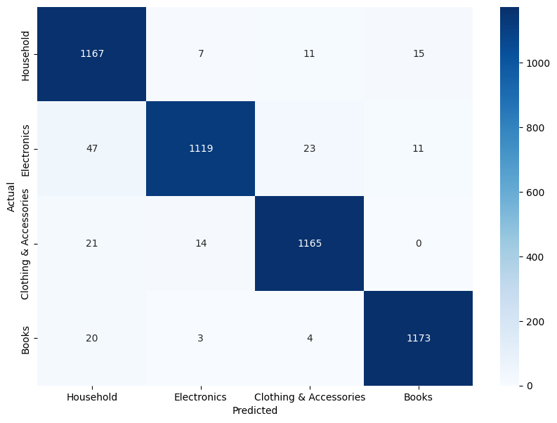

# Ecommerce Text Classification using TF-IDF Vectorizer

TF-IDF Vectorizer (Term Frequency-Inverse Document Frequency) is a method used in text mining to evaluate how important a word is in a document relative to a collection of documents. It transforms text into numerical vectors for use in machine learning.

## Purpose:
- Highlights important words in a document.
- Downweighs common but less informative words.

## Result: Confusion Matrix

